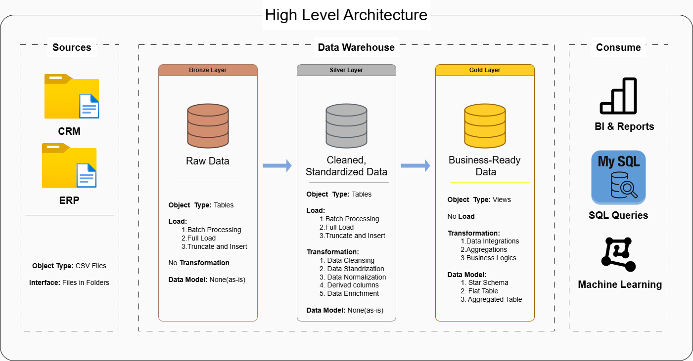

# Data Warehouse and Analytics Project

Welcome to the  **Data Warehouse and Analytics Project** repository!
This project demonstrates a comprehensive data warehousing and analytics solution, from building a data warehouse to generating actionable insights. Designed as a portfolio project highlights industry best practices in data engineering and analysis.

---
## 🚀 Project Requirnments

### Building the Data Warehouse

#### Objective
Develop a modern data warehouse using SQL server to consolidate sales data, enabling analytical reporting and informed decision-making.

#### Specifications
- **Data Sources** : Import data from two source systems (ERP and CRM) provided as CSV files.
- **Data Quality** : Cleanse and resolve data quality issue prior to analysis.
- **Integration** : Combine both sources into  a single, user-friendly data model designed for anlytical queries.
- **Scope** : Focus on the latest dataset only; historization of data is not required.
- **Documentation** : Provide clear documnetation on the data model to support both business stakeholders and analytics teams.

---

### BI: Analytics and Reporting 

#### Objective 
Develop SQL-based analytics to deliver detailed insights into:
- **Customer Behaviour**
- **Product Performance**
- **Sales Trends**

These insights empower stakeholders with key business metrics, enabling strategic decision-making.

---
Great Hiral 😄 Here is a **clean, professional README template** you can directly paste into your **GitHub repository**. This format is commonly used in **data engineering and analytics projects** and makes your repo look much more professional.

---

# Data Warehouse Project

## Project Overview

This project demonstrates the design and implementation of a **Data Warehouse using the Medallion Architecture (Bronze, Silver, and Gold layers)**. The goal of the project is to transform raw operational data into **clean, structured, and analytics-ready datasets** that support business intelligence and reporting.

The pipeline begins with the **Bronze layer**, where raw data from multiple source systems is ingested without modification. The **Silver layer** focuses on data cleaning, transformation, and standardization to improve data quality. Finally, the **Gold layer** presents the refined data in a **Star Schema format consisting of dimension and fact tables**, making it suitable for analytical queries and reporting.

To ensure reliability and accuracy, the project also includes **data quality checks** that validate data integrity, detect duplicates, and maintain referential relationships between fact and dimension tables.

---

## Architecture

The project follows the **Medallion Data Architecture**:



Bronze Layer
Raw data ingestion from source systems.

Silver Layer
Data cleaning, transformation, and standardization.

Gold Layer
Business-ready data modeled using **Star Schema** for analytics.

---

## Data Model
## Data Warehouse Architecture


The final **Gold Layer** is designed using a **Star Schema** consisting of:

Fact Table

* `fact_sales` – Stores transactional sales data.

Dimension Tables

* `dim_customers` – Contains customer information.
* `dim_products` – Contains product and category information.

This schema enables efficient aggregation, filtering, and reporting for analytical use cases.

---

## Data Quality Checks

The project includes several validation checks to ensure data reliability:

* Detection of duplicate records in dimension tables
* Validation of surrogate key uniqueness
* Referential integrity checks between fact and dimension tables
* Verification of cleaned and standardized fields

These checks help maintain **high data quality in the analytical layer**.

---

## Project Structure

```
data-warehouse-project
│
├── datasets
│
├── diagrams
│   ├── architecture.drawio
│   └── star_schema.drawio
│
├── sql
│   ├── bronze_layer.sql
│   ├── silver_layer.sql
│   ├── gold_layer.sql
│   └── quality_checks.sql
│
└── README.md
```

---

## Technologies Used

* SQL (Data Transformation & Modeling)
* Draw.io (Data Architecture Diagrams)
* GitHub (Version Control)
* Data Warehouse Design (Star Schema)

---

## Key Learning Outcomes

* Implementing **Medallion Data Architecture**
* Designing **Star Schema data models**
* Building **ETL data transformation pipelines**
* Performing **data quality validation checks**
* Organizing a **data engineering project using GitHub**

---

⭐ If you found this project helpful, feel free to explore the repository.

---

✅ This README will make your project look **much more professional on GitHub**.

---

If you want, I can also show you **one small GitHub trick that makes your README look 10x better (adding architecture diagrams and icons)**.


## ✔ License

This project is licensed under the [MIT License].(LICENSE). You are free to use, modify, and share this project with proper attribution.

## 🌟 About

I'm **Hiral Paresh Patel** B-tech student in the branch of **Aritificial Intelligence and Data Science (AI & DS), 2nd year**.
